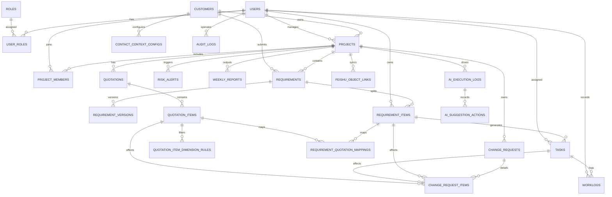
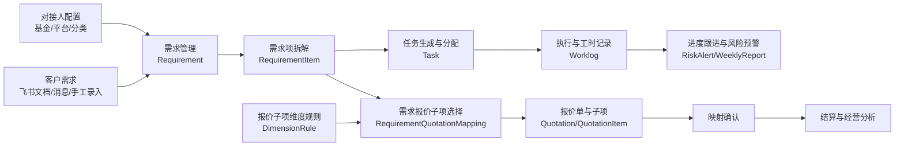
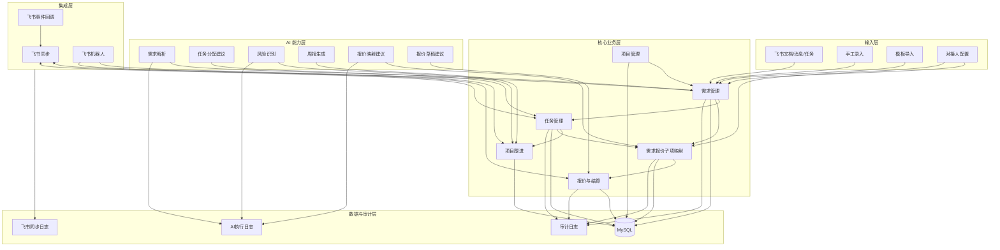
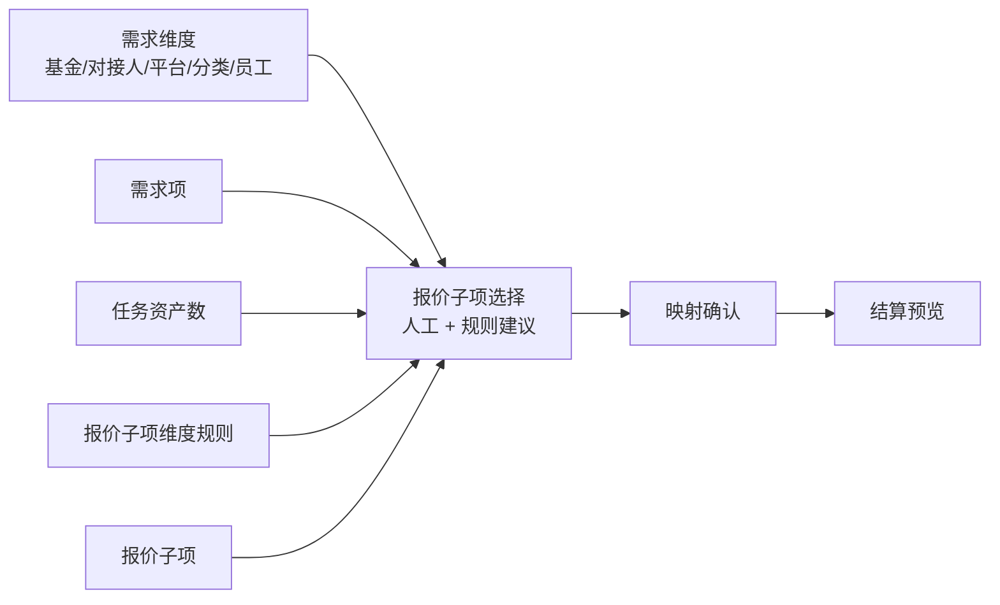
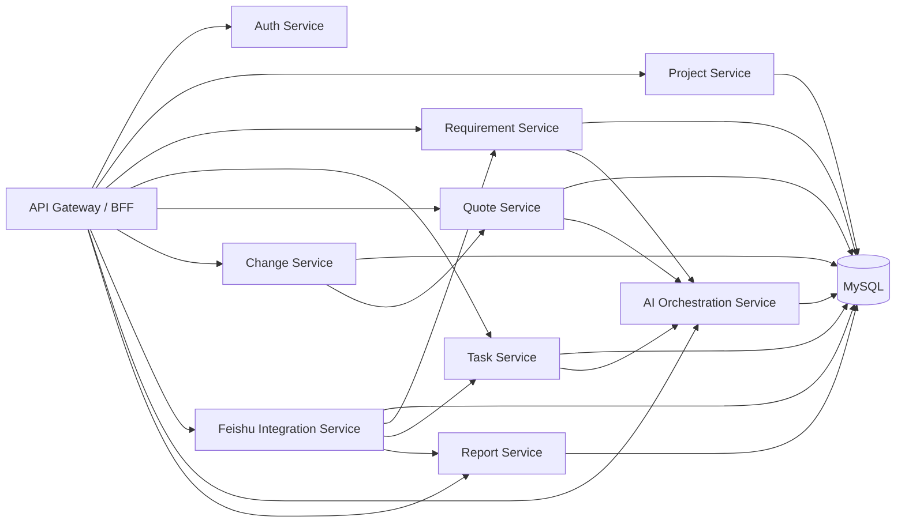

# 效能引擎 ER 图与模块关系图

## 1. 说明

本文档使用 Mermaid 描述效能引擎的核心实体关系和模块协作关系，可直接用于评审、Wiki 或后续补充架构设计。

## 2. 核心 ER 图

## 3. 核心业务链路图

## 4. 模块关系图

## 5. 需求报价子项选择专题图

这是本项目最关键的断层修复模块。

## 6. 后端服务建议关系图

如果后端后续拆分模块，可以按下面的服务边界组织。

## 7. 建议阅读顺序

1. 先看“核心业务链路图”
2. 再看“需求报价子项选择专题图”
3. 然后看“核心 ER 图”
4. 最后结合 [DB_SCHEMA.md](DB_SCHEMA.md) 和 [API_SPEC.md](API_SPEC.md) 进入开发
