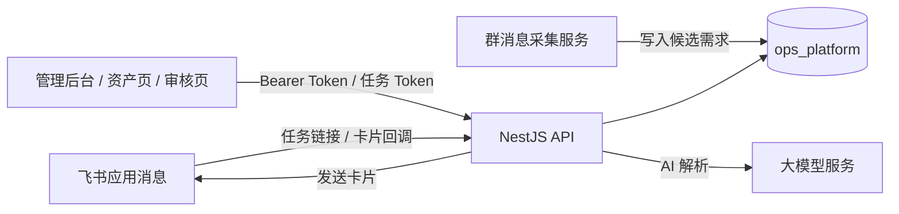
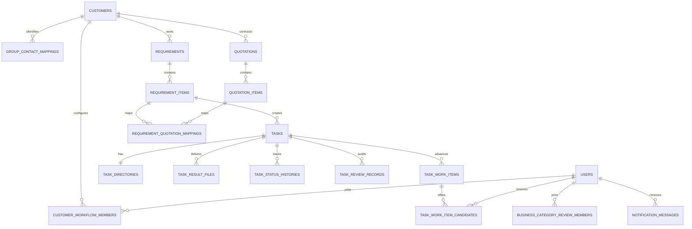
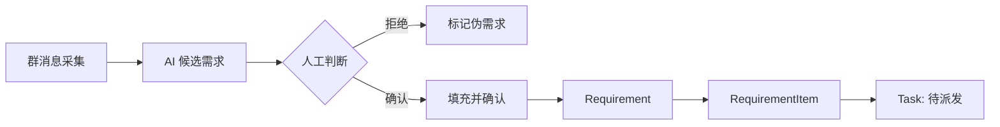
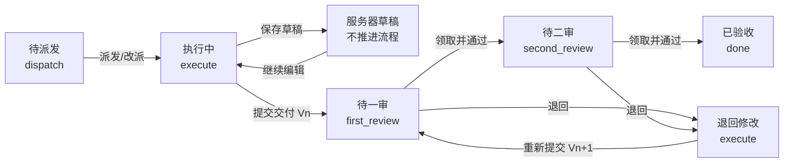
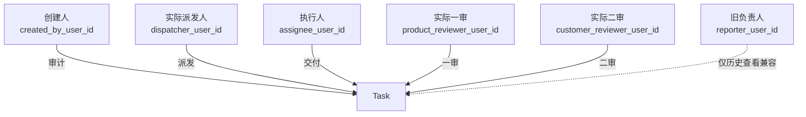
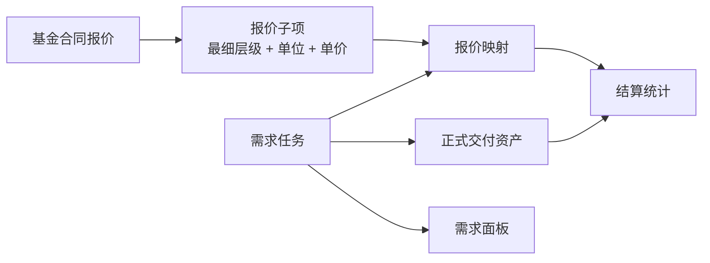

# 向量引擎管理工作台架构图

更新时间：2026-08-03

本文档只描述当前有效实现。更细的字段和接口分别见 [DB_SCHEMA.md](DB_SCHEMA.md)、[DATA_FLOW.md](DATA_FLOW.md) 和 [API_SPEC.md](API_SPEC.md)。

## 系统边界

```mermaid
flowchart LR
    CRAWLER[群消息采集服务]
    FEISHU[飞书应用消息]
    BROWSER[管理后台 / 资产页 / 审核页]
    API[NestJS API]
    DB[(ops_platform)]
    MODEL[大模型服务]

    CRAWLER -->|写入候选需求| DB
    BROWSER -->|Bearer Token / 任务 Token| API
    FEISHU -->|任务链接 / 卡片回调| API
    API --> DB
    API -->|AI 解析| MODEL
    API -->|发送卡片| FEISHU
```

边界约定：

- `ops_platform` 保存管理工作台的配置、候选需求、正式需求、任务、资产、审核、报价和结算数据。
- 采集服务负责群消息采集和候选需求生产，不直接创建正式需求或任务。
- 候选需求必须经派发者或管理员人工确认后，才进入正式业务链路。
- 飞书只是通知和快捷入口，任务状态与权限以 `ops_platform` 为准。

## 核心实体

```mermaid
erDiagram
    CUSTOMERS ||--o{ GROUP_CONTACT_MAPPINGS : identifies
    CUSTOMERS ||--o{ CUSTOMER_WORKFLOW_MEMBERS : configures
    USERS ||--o{ CUSTOMER_WORKFLOW_MEMBERS : joins
    USERS ||--o{ BUSINESS_CATEGORY_REVIEW_MEMBERS : joins

    CUSTOMERS ||--o{ REQUIREMENTS : owns
    REQUIREMENTS ||--o{ REQUIREMENT_ITEMS : contains
    REQUIREMENT_ITEMS ||--o{ TASKS : creates

    TASKS ||--|| TASK_DIRECTORIES : has
    TASKS ||--o{ TASK_RESULT_FILES : delivers
    TASKS ||--o{ TASK_STATUS_HISTORIES : tracks
    TASKS ||--o{ TASK_REVIEW_RECORDS : audits
    TASKS ||--o{ TASK_WORK_ITEMS : advances
    TASK_WORK_ITEMS ||--o{ TASK_WORK_ITEM_CANDIDATES : offers
    USERS ||--o{ TASK_WORK_ITEM_CANDIDATES : receives

    CUSTOMERS ||--o{ QUOTATIONS : contracts
    QUOTATIONS ||--o{ QUOTATION_ITEMS : contains
    REQUIREMENT_ITEMS ||--o{ REQUIREMENT_QUOTATION_MAPPINGS : maps
    QUOTATION_ITEMS ||--o{ REQUIREMENT_QUOTATION_MAPPINGS : maps

    USERS ||--o{ NOTIFICATION_MESSAGES : receives
```

## 需求链路

```mermaid
flowchart LR
    A[群消息采集]
    B[AI 候选需求]
    C{人工判断}
    D[标记伪需求]
    E[填充并确认]
    F[Requirement]
    G[RequirementItem]
    H[Task: 待派发]

    A --> B --> C
    C -->|拒绝| D
    C -->|确认| E --> F --> G --> H
```

上下文和分类分开维护：

- `group_contact_mappings`：群 + 对接人确定基金和业务平台。
- `business_category_secondary_categories`：业务大类确定可选二级分类。
- `customer_workflow_members`：基金确定派发者和二审候选人。
- `business_category_review_members`：业务大类确定一审候选人。

## 任务审核链路

```mermaid
flowchart LR
    D[待派发<br/>dispatch]
    E[执行中<br/>execute]
    S[服务器草稿<br/>不推进流程]
    F[待一审<br/>first_review]
    G[待二审<br/>second_review]
    H[已验收<br/>done]
    R[退回修改<br/>execute]

    D -->|派发/改派| E
    E -->|保存草稿| S
    S -->|继续编辑| E
    E -->|提交交付 Vn| F
    F -->|领取并通过| G
    G -->|领取并通过| H
    F -->|退回| R
    G -->|退回| R
    R -->|重新提交 Vn+1| F
```

一致性规则：

- 派发、执行、一审和二审分别用工作项表达，候选人与实际处理人分开。
- 一审和二审领取使用数据库原子条件更新；同一工作项只能有一个处理人。
- 保存草稿只写 `task_directories`，不写正式资产、不通知审核人、不进入统计。
- 提交交付写入 `task_result_files`，递增 `delivery_version`，并新建一审工作项。
- 一审通过只切换审核阶段，二审通过才将任务置为 `completed`。

## 任务身份

```mermaid
flowchart TB
    CREATOR[创建人<br/>created_by_user_id]
    DISPATCHER[实际派发人<br/>dispatcher_user_id]
    ASSIGNEE[执行人<br/>assignee_user_id]
    FIRST[实际一审<br/>product_reviewer_user_id]
    SECOND[实际二审<br/>customer_reviewer_user_id]
    LEGACY[旧负责人<br/>reporter_user_id]

    CREATOR -->|审计| TASK[Task]
    DISPATCHER -->|派发| TASK
    ASSIGNEE -->|交付| TASK
    FIRST -->|一审| TASK
    SECOND -->|二审| TASK
    LEGACY -.仅历史查看兼容.-> TASK
```

## 报价与统计

```mermaid
flowchart LR
    CONTRACT[基金合同报价]
    ITEMS[报价子项<br/>最细层级 + 单位 + 单价]
    TASK[需求任务]
    MAP[报价映射]
    ASSETS[正式交付资产]
    SETTLEMENT[结算统计]
    DASHBOARD[需求面板]

    CONTRACT --> ITEMS --> MAP
    TASK --> MAP
    TASK --> ASSETS
    MAP --> SETTLEMENT
    ASSETS --> SETTLEMENT
    TASK --> DASHBOARD
```

- 需求面板只统计需求数量、进度、时效和执行情况，不展示金额。
- 结算统计按基金、时间及其他业务维度统计正式资产数量和结算金额。
- 服务器草稿不进入任何统计口径。
